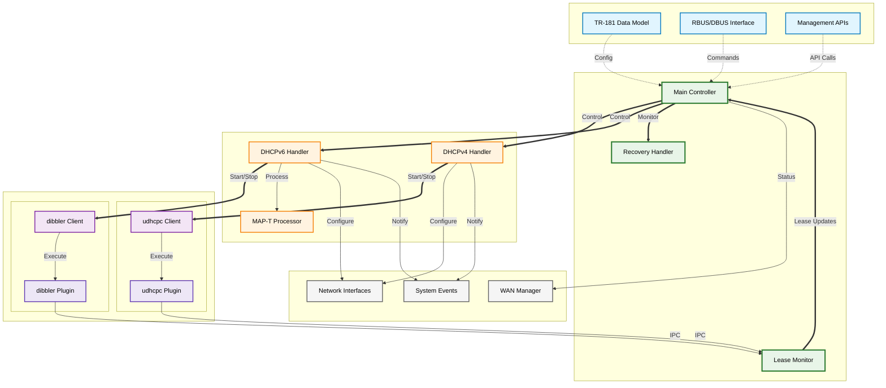
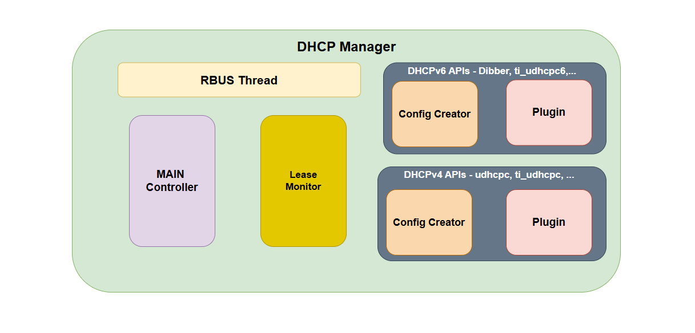
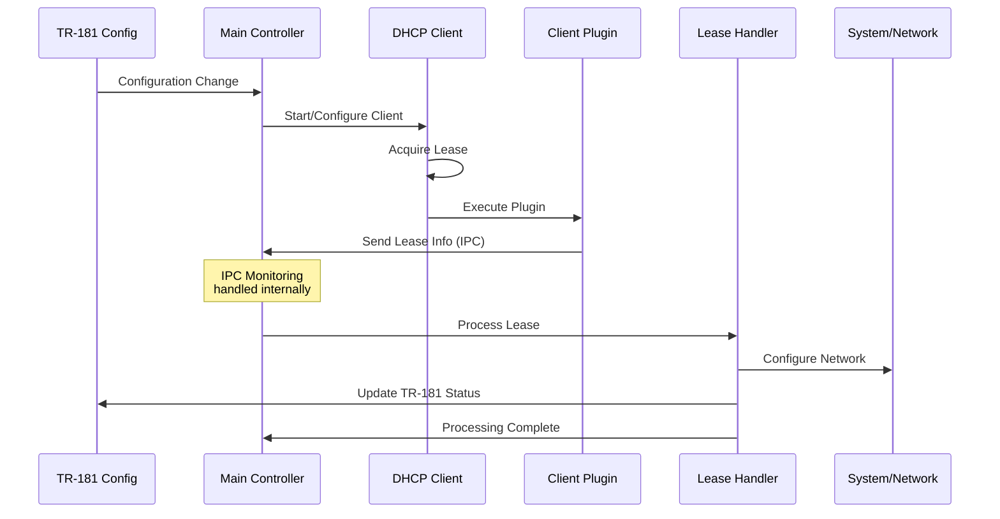
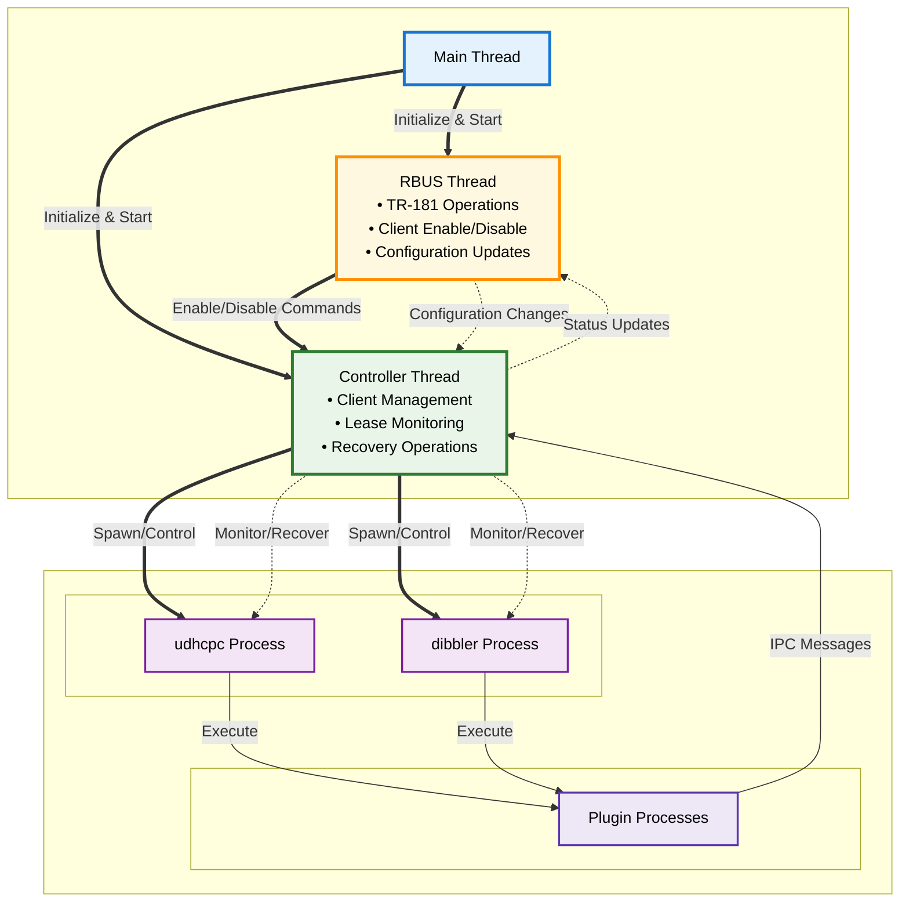
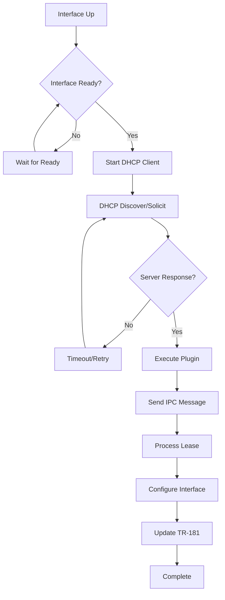
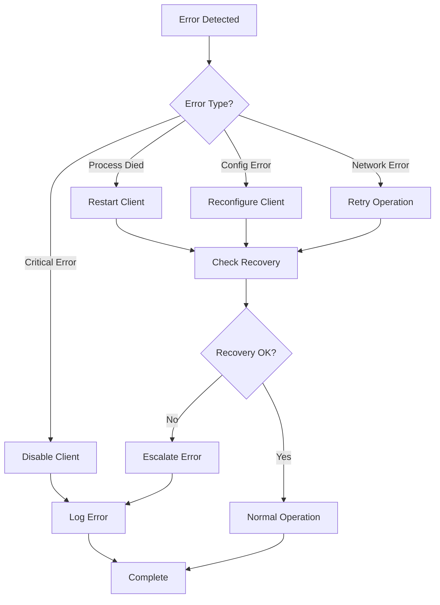
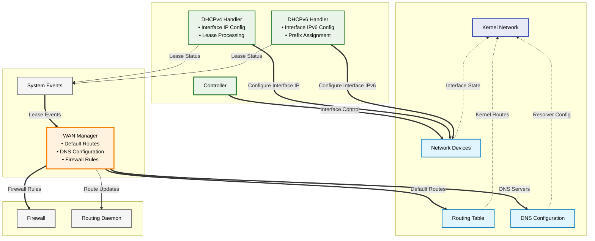
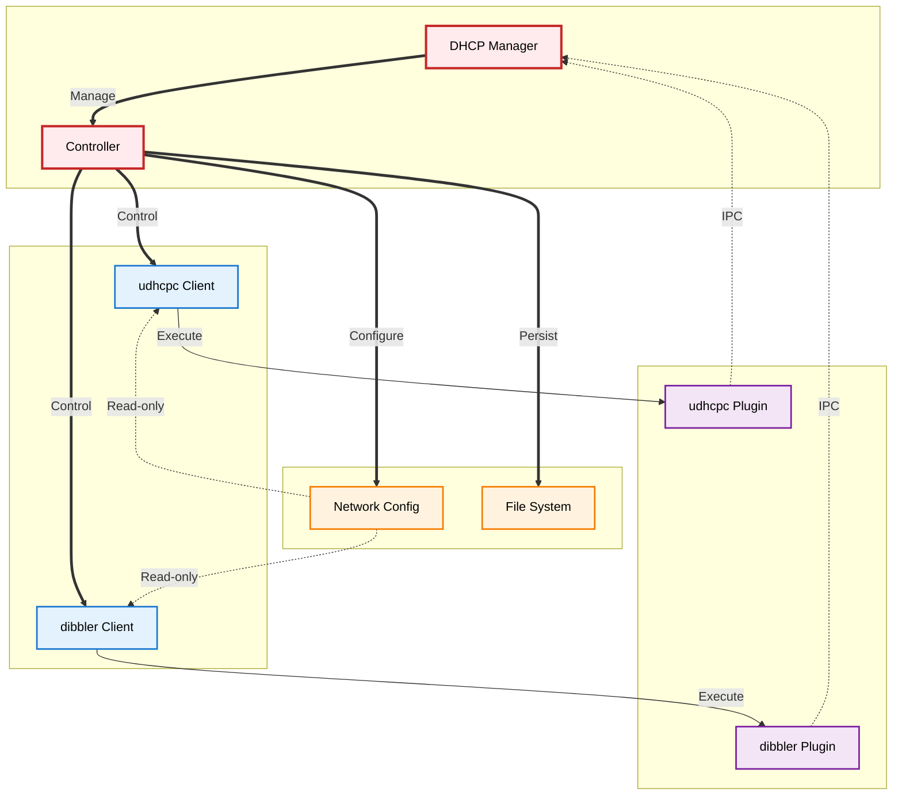
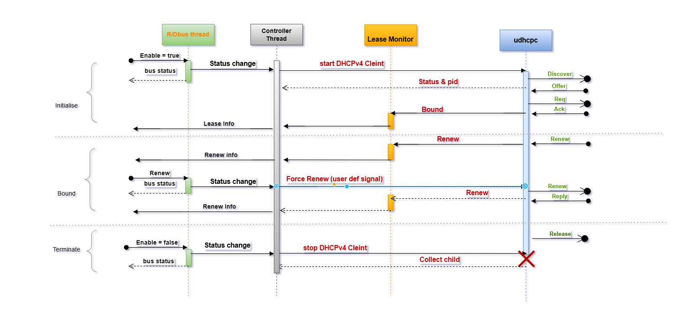
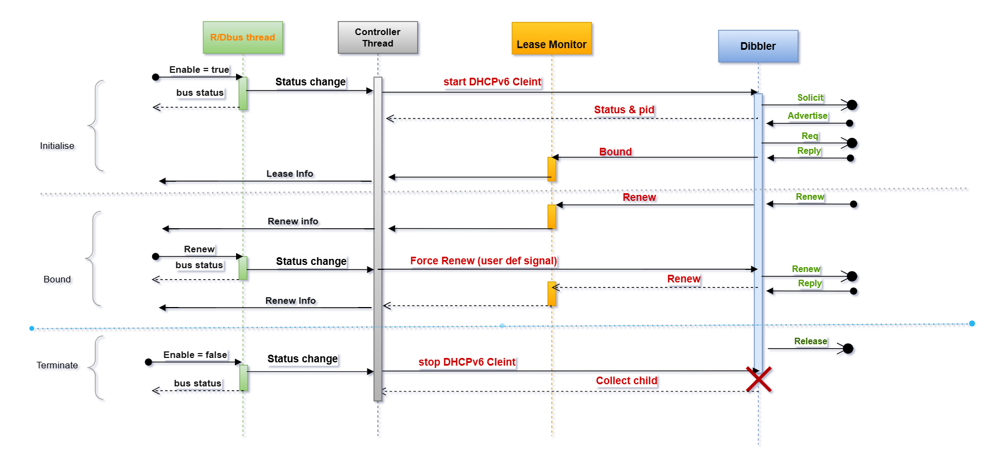

# DHCP Client Manager Architecture

## Component Overview

The DHCP Client Manager architecture is designed around a modular, event-driven approach that provides centralized management of DHCP operations while maintaining clear separation of concerns between different functional areas.

## High-Level Architecture

## Component Responsibilities

*Figure 1: DHCP Manager Component Block Diagram - Shows the main components and their interactions within the RDK-B DHCP Management system*

### Main Controller
- **Central Coordination**: Orchestrates all DHCP client operations
- **State Management**: Maintains client operational states
- **Interface Monitoring**: Tracks network interface status
- **Configuration Management**: Processes TR-181 configuration changes
- **Error Handling**: Implements recovery and error handling strategies
- **Process Monitoring**: Monitors DHCP client process health

### Lease Monitor
- **IPC Server**: Receives lease updates from DHCP client plugins
- **Message Routing**: Routes lease information to appropriate handlers
- **Protocol Detection**: Identifies DHCPv4 vs DHCPv6 messages
- **Fast Processing**: Minimal latency message processing

### Protocol(Lease) Handlers
- **DHCPv4 Handler**: Processes IPv4 lease information and network configuration
- **DHCPv6 Handler**: Processes IPv6 lease information including IANA/IAPD
- **MAP-T Processor**: Handles IPv4-over-IPv6 transition technology

### Recovery Handler
- **Persistence**: Stores lease information for system restart recovery
- **State Restoration**: Restores system state after crashes or restarts

## Data Flow Architecture

## Threading Model

### Thread Architecture

### Thread Responsibilities

#### Main Thread
- **Initialization**: System startup and component initialization
- **Signal Handling**: Process system signals and shutdown
- **Thread Management**: Initialize and start RBUS and controller threads
- **System Coordination**: Coordinate between different threads during startup/shutdown

#### RBUS Thread
The RBUS thread handles all TR-181 Data Model operations and external management interface:

- **TR-181 Operations**: Handle all data model get/set operations
- **RBUS Management**: Manage RBUS/DBUS communications and subscriptions
- **Client Control Commands**: Process enable/disable commands for DHCP clients
- **Configuration Management**: Handle configuration changes from external management
- **Status Reporting**: Report client status and lease information to TR-181 data model
- **Parameter Validation**: Validate configuration parameters before applying
- **Event Notifications**: Generate TR-181 events for configuration and status changes

#### Controller Thread
The controller thread is the primary worker thread that handles all core DHCP management operations:

- **Client Management**: Start/stop/configure DHCP clients based on RBUS commands
- **Lease Processing**: Process lease updates from plugins via IPC
- **State Monitoring**: Monitor interface and client states
- **Configuration Updates**: Apply configuration changes received from RBUS thread
- **Recovery Operations**: Called as APIs before the main controller loop
  - Process health checking and restart operations
  - Lease recovery from persistent storage
  - System state restoration after crashes
- **IPC Listening**: Listen for plugin messages on the IPC socket
- **Message Processing**: Parse and validate lease messages from plugins
- **Data Routing**: Route processed messages to appropriate handlers
- **Error Handling**: Handle communication and operational errors

## Message Flow Patterns

### Lease Acquisition Flow

### Error Recovery Flow

## Interface Architecture

### Network Interface Integration

### TR-181 Integration Points

The DHCP Manager integrates with TR-181 at multiple levels:

#### Configuration Parameters
- `Device.DHCPv4.Client.{i}.*` - DHCPv4 client configuration
- `Device.DHCPv6.Client.{i}.*` - DHCPv6 client configuration
- Custom vendor parameters and extensions

#### Status Parameters
- Lease information and status
- Client operational state
- Error conditions and diagnostics
- Performance metrics

#### Operational Commands
- Client enable/disable operations
- Lease renewal commands
- Reset and restart operations
- Diagnostic commands

## Security Architecture

### Process Isolation

## DHCP Protocol Sequences

### DHCPv4 Sequence Flow

*Figure 2: DHCPv4 Sequence Diagram - Shows the complete DHCPv4 lease acquisition and processing flow from client startup through network configuration*

The DHCPv4 sequence illustrates the interaction between the DHCP Manager, udhcpc client, and the udhcpc plugin during lease acquisition:

1. **Client Initialization**: Main controller starts udhcpc client based on TR-181 configuration
2. **DHCP Discovery**: udhcpc performs standard DHCP discovery process (DISCOVER/OFFER/REQUEST/ACK)
3. **Plugin Execution**: Upon lease acquisition, udhcpc executes the plugin with lease information
4. **IPC Communication**: Plugin sends lease data to the controller via IPC
5. **Lease Processing**: Controller processes the lease and updates interface configuration
6. **Interface Configuration**: Interface is configured with IP address and interface-specific settings
7. **System Events**: Lease status events are sent to system for WAN Manager processing
8. **WAN Manager Integration**: WAN Manager handles default routes, DNS, and firewall configuration
9. **Status Update**: TR-181 data model is updated with current lease information

### DHCPv6 Sequence Flow

*Figure 3: DHCPv6 Sequence Diagram - Shows the complete DHCPv6 lease acquisition and processing flow including IANA and IAPD handling*

The DHCPv6 sequence demonstrates the more complex IPv6 lease acquisition process:

1. **Client Initialization**: Main controller starts dibbler client with IPv6-specific configuration
2. **DHCPv6 Solicitation**: dibbler performs DHCPv6 solicitation process (SOLICIT/ADVERTISE/REQUEST/REPLY)
3. **Dual Association**: Handles both IANA (Identity Association for Non-temporary Addresses) and IAPD (Identity Association for Prefix Delegation)
4. **Plugin Execution**: dibbler executes the plugin with comprehensive IPv6 lease information
5. **IPC Communication**: Plugin sends detailed IPv6 lease data including addresses and prefixes
6. **Lease Processing**: Controller processes both address assignments and prefix delegations
7. **Interface Configuration**: Interface is configured with IPv6 addresses and prefixes
8. **System Events**: IPv6-specific lease events are generated for WAN Manager processing
9. **WAN Manager Integration**: WAN Manager handles IPv6 default routes, DNS, and system configuration
10. **Status Update**: TR-181 data model is updated with IPv6 lease information

## Extension Points

### Plugin Architecture
- **Client Plugins**: Extend support to new DHCP clients
- **Protocol Extensions**: Add support for new DHCP options
- **Custom Handlers**: Implement custom lease processing
- **Integration Hooks**: Add hooks for external system integration

### Configuration Extensions
- **Custom Options**: Support for vendor-specific options
- **Policy Engines**: Pluggable policy decision engines
- **Validation Rules**: Custom validation rule engines
- **Event Handlers**: Custom event processing extensions

This architectural documentation provides the foundation for understanding how the DHCP Client Manager components interact and can be extended or modified to meet specific deployment requirements.