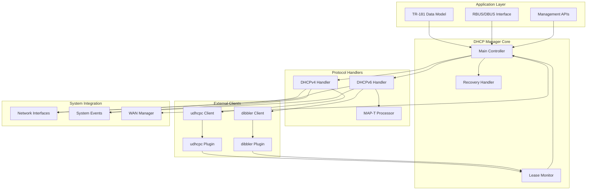
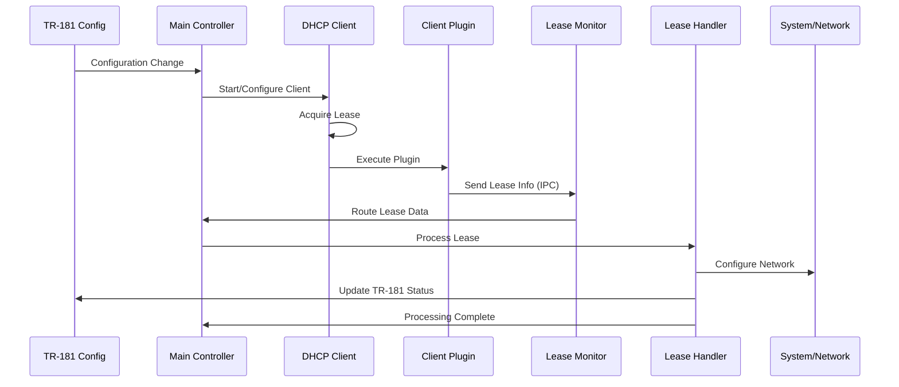
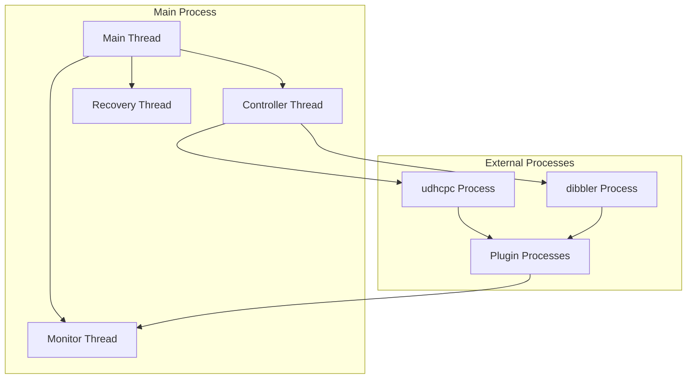
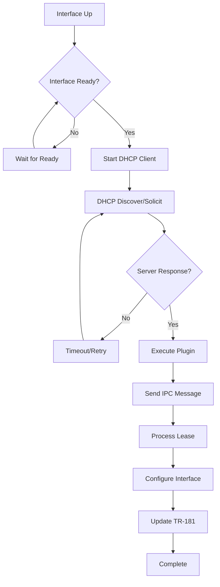
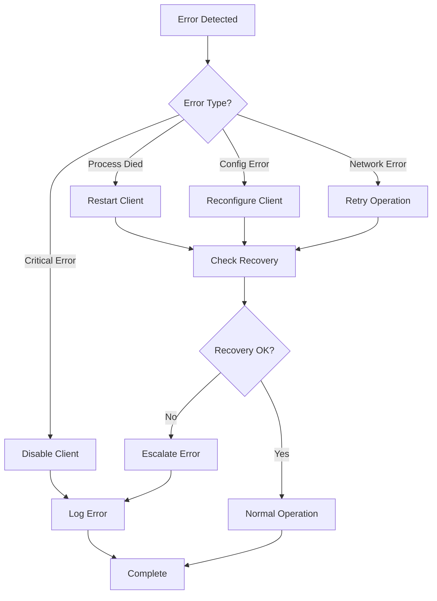
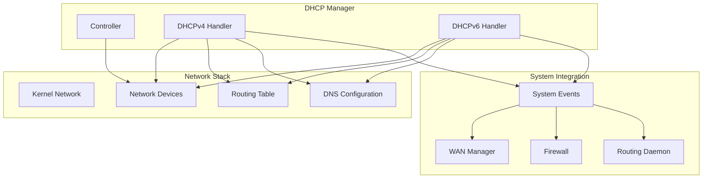
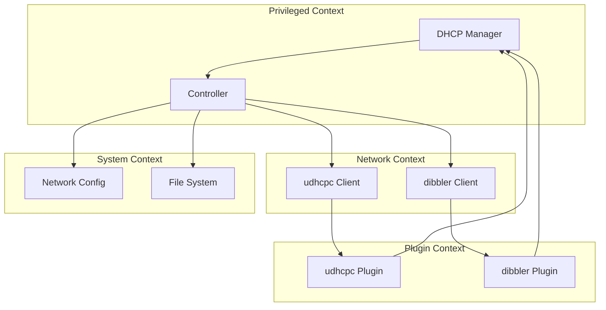

# DHCP Client Manager Architecture

## Component Overview

The DHCP Client Manager architecture is designed around a modular, event-driven approach that provides centralized management of DHCP operations while maintaining clear separation of concerns between different functional areas.

## High-Level Architecture

## Component Responsibilities

### Main Controller
- **Central Coordination**: Orchestrates all DHCP client operations
- **State Management**: Maintains client operational states
- **Interface Monitoring**: Tracks network interface status
- **Configuration Management**: Processes TR-181 configuration changes
- **Error Handling**: Implements recovery and error handling strategies

### Lease Monitor
- **IPC Server**: Receives lease updates from DHCP client plugins
- **Message Routing**: Routes lease information to appropriate handlers
- **Protocol Detection**: Identifies DHCPv4 vs DHCPv6 messages
- **Fast Processing**: Minimal latency message processing

### Protocol Handlers
- **DHCPv4 Handler**: Processes IPv4 lease information and network configuration
- **DHCPv6 Handler**: Processes IPv6 lease information including IANA/IAPD
- **MAP-T Processor**: Handles IPv4-over-IPv6 transition technology

### Recovery Handler
- **Persistence**: Stores lease information for system restart recovery
- **Process Monitoring**: Monitors DHCP client process health
- **State Restoration**: Restores system state after crashes or restarts

## Data Flow Architecture

## Threading Model

### Thread Architecture

### Thread Responsibilities

#### Main Thread
- **Initialization**: System startup and component initialization
- **TR-181 Operations**: Handle data model operations
- **RBUS Management**: Manage RBUS/DBUS communications
- **Signal Handling**: Process system signals and shutdown

#### Controller Thread
- **Client Management**: Start/stop/configure DHCP clients
- **Lease Processing**: Process lease updates from monitor
- **State Monitoring**: Monitor interface and client states
- **Configuration Updates**: Apply configuration changes

#### Monitor Thread
- **IPC Listening**: Listen for plugin messages
- **Message Processing**: Parse and validate lease messages
- **Data Routing**: Route messages to controller
- **Error Handling**: Handle communication errors

#### Recovery Thread
- **Process Monitoring**: Monitor DHCP client processes
- **Health Checking**: Detect process failures
- **Recovery Actions**: Restart failed clients
- **Cleanup**: Remove dead process tracking

## Message Flow Patterns

### Lease Acquisition Flow

### Error Recovery Flow

## Interface Architecture

### Network Interface Integration

### TR-181 Integration Points

The DHCP Manager integrates with TR-181 at multiple levels:

#### Configuration Parameters
- `Device.DHCPv4.Client.{i}.*` - DHCPv4 client configuration
- `Device.DHCPv6.Client.{i}.*` - DHCPv6 client configuration
- Custom vendor parameters and extensions

#### Status Parameters
- Lease information and status
- Client operational state
- Error conditions and diagnostics
- Performance metrics

#### Operational Commands
- Client enable/disable operations
- Lease renewal commands
- Reset and restart operations
- Diagnostic commands

## Security Architecture

### Process Isolation

### Security Considerations

#### Process Security
- **Privilege Separation**: Different components run with minimal required privileges
- **Process Isolation**: DHCP clients run as separate processes
- **Plugin Sandboxing**: Plugins have limited system access

#### Communication Security
- **Local IPC**: All communication uses local IPC mechanisms
- **Message Validation**: All messages are validated before processing
- **Error Isolation**: Errors in one component don't affect others

#### File System Security
- **Temporary Storage**: Recovery files stored in secure temporary directory
- **Permission Control**: Appropriate file permissions for lease data
- **Atomic Operations**: Atomic file operations prevent corruption

## Performance Architecture

### Optimization Strategies

#### Memory Management
- **Static Allocation**: Prefer stack allocation over dynamic allocation
- **Memory Pooling**: Reuse common data structures
- **Lazy Loading**: Load data only when needed
- **Garbage Collection**: Timely cleanup of unused resources

#### Processing Optimization
- **Asynchronous Processing**: Non-blocking lease processing
- **Batch Operations**: Group related operations
- **Caching**: Cache frequently accessed data
- **Fast Path**: Optimize common operation paths

#### I/O Optimization
- **Buffered I/O**: Use appropriate buffer sizes
- **Async I/O**: Non-blocking file operations where possible
- **Minimal Syscalls**: Reduce system call overhead
- **Efficient Protocols**: Use binary protocols for IPC

## Scalability Considerations

### Multi-Interface Support
- **Parallel Processing**: Handle multiple interfaces concurrently
- **Resource Scaling**: Scale resources based on interface count
- **State Isolation**: Isolate state between interfaces
- **Load Distribution**: Distribute processing across available cores

### Performance Limits
- **Interface Count**: Efficiently handle dozens of interfaces
- **Lease Volume**: Process high lease turnover rates
- **Memory Usage**: Bounded memory usage regardless of scale
- **Response Time**: Maintain consistent response times under load

## Extension Points

### Plugin Architecture
- **Client Plugins**: Extend support to new DHCP clients
- **Protocol Extensions**: Add support for new DHCP options
- **Custom Handlers**: Implement custom lease processing
- **Integration Hooks**: Add hooks for external system integration

### Configuration Extensions
- **Custom Options**: Support for vendor-specific options
- **Policy Engines**: Pluggable policy decision engines
- **Validation Rules**: Custom validation rule engines
- **Event Handlers**: Custom event processing extensions

This architectural documentation provides the foundation for understanding how the DHCP Client Manager components interact and can be extended or modified to meet specific deployment requirements.